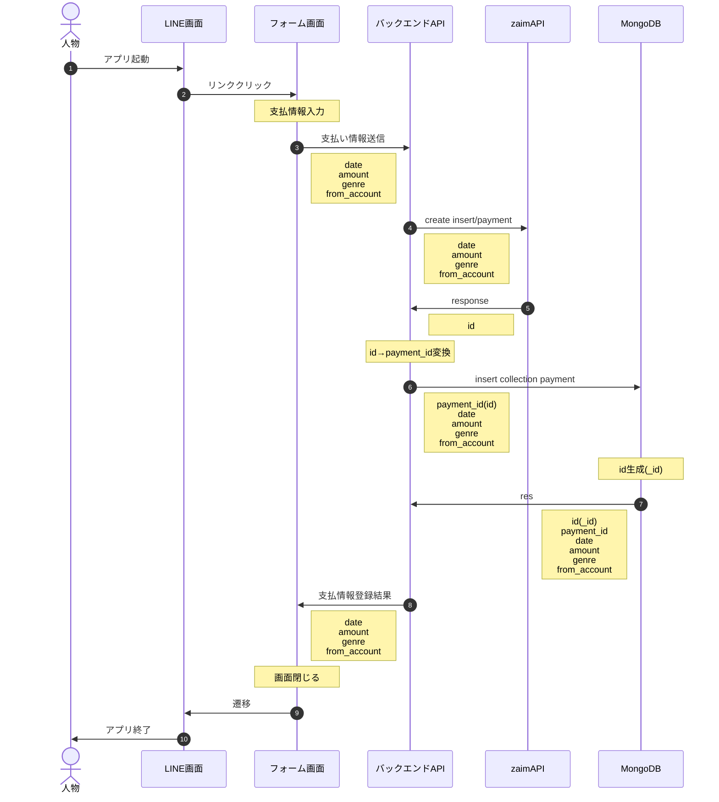

# シーケンス図

```mermaid
sequenceDiagram
    autonumber
    actor person as 人物
    participant line as LINE画面
    participant frontend as フォーム画面
    participant backend as バックエンドAPI
    participant zaim as zaimAPI
    participant db as MongoDB
    person ->> line:アプリ起動
    line ->> frontend :リンククリック
    Note over frontend:支払情報入力
    frontend ->> backend:支払い情報送信
    Note right of frontend:date<br>amount<br>genre<br>from_account
    backend ->> zaim:create insert/payment
    Note right of backend:date<br>amount<br>genre<br>from_account
    zaim ->> backend:response
    Note left of zaim:id
    Note over backend:id→payment_id変換
    backend ->> db:insert collection payment
    Note right of backend:payment_id(id)<br>date<br>amount<br>genre<br>from_account
    Note over db:id生成(_id)
    db ->> backend:res
    Note left of db:id(_id)<br>payment_id<br>date<br>amount<br>genre<br>from_account
    backend ->> frontend:支払情報登録結果
    Note left of backend:date<br>amount<br>genre<br>from_account
    Note over frontend:画面閉じる
    frontend ->> line:遷移
    line ->> person:アプリ終了
```
